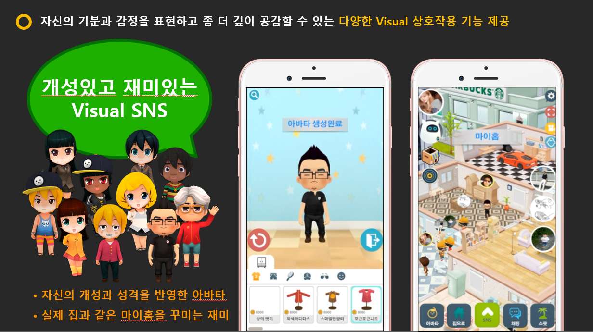
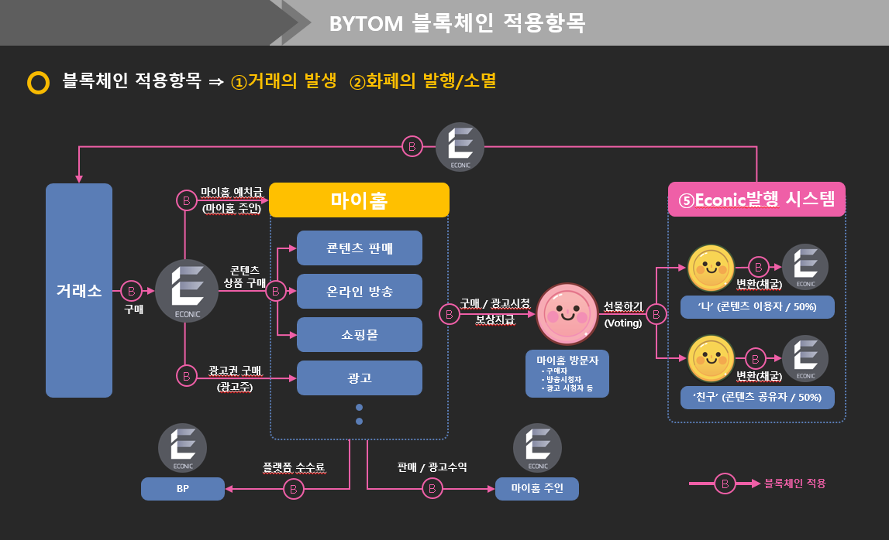

Judging Rules & V-Story Answer  
----

JR1)Blockchain Adoption
----
All entries must be built on Bytom smart contracts while fully
embodying the value and advantage of Blockchain technology
and proving that the Blockchain technology is definitely
irreplaceable when compared with the solutions based on the
traditional technology.  

JR1)V-Story Answer
----

Social Life Service V-Story는 저작권보호, 보안, 공정성과 투명성을 중시하는 탈중앙화 서비스 입니다.      
  > 저작권에서는 SNS 주요 자산인 사용자들이 생산한 콘텐츠에 대한 저작권을 블록체인 기술을 통해 보호하며,  
  > 보안에서는 사용자 간의 토큰 유통을 블록체인기술로 기록하여 변조를 방지하고 보안성을 높이고,  
  > 공정성과 투명성에서는 토큰의 흐름과 보유 및 보상을 누구나 확인할 수 있게 공개합니다.  
  > 이로 인하여 2차 저작물의 활성화 및 가짜 뉴스 및 악성댓글등의 SNS 사회적 문제 해소,  
  > 개인간 거래의 투명성을 높이고자 합니다.  

우리는 Bytom 블록체인 프로토콜이 가상세계와 현실세계를 연결시켜 인간이 상상할 수 있는   
  > 모든 자산의 거래를 가능하게 하는 쌍방향 프로토콜이며, 세계에서 가장 안전하고 가장 큰 자산거래 및   
  > 관리 프로토콜이 되는 것이 목표이고, 자체적으로 구축한 메인넷 내의 생태계는 개방형, 준법성, 공익성이라는    
  > 3가지 특징이 있음을 확인하였습니다. 이에 V-Story가 추구하는 Social Life Service  플랫폼으로 확장에   
  > 큰 도움이 될 것이라 기대하고 있습니다.  

JR2)Technology Implementation
----

The smart contract projects should feature rational design and
complete functional design. Its stable operation is absolutely a
guarantee for efficiency and quality. Moreover, it is designed
with sufficient safety and protection mechanism.  
  
JR2)V-Story Answer
----

JR3)Commercial Value
----

If entries presents great commercial value, they can be
commercialized directly as representatives of industry
application for potential profitability.  
  
JR3)V-Story Answer
----

JR4)Creativity
----

Compared with those mature solutions in the industry, entries
should illustrate innovation and creativity with better
performance.  

JR4)V-Story Answer
----

V-Story 텍스트, 사진, 영상을 넘어 아바타, 홈꾸미기 등을 통해 자신만의 개성있는 SNS를 만들며 다른 사용자와  
관계형 네트워크를 형성할 수 있는 새로운 개념의 비쥬얼 Social Life Service 플랫폼입니다.  
  
  
JR5)roduct Design
----

The interactive design should be reasonable so that customers
can easily understand and use, thus achieving a better user
experience.  
  
JR5)V-Story Answer
----

자신의 기분과 감정을 표현하고 좀 더 깊이 공감할 수 있는 다양한 Visual 상호작용 기능 제공
‘설치’ 없이 다양한 디바이스에서 구동, 외부 콘텐츠와 쉽게 연동

# V-Story 바이텀 블록체인 연동 컨셉 기획안

## 세부 컨셉안들 (제목을 클릭하여 세부 페이지로 이동)

### 1. [바이텀 지갑 기능 연동 컨셉안](https://github.com/v-story/v-story-bytom-wallet)

V-Story에 바이텀 암호화폐를 연동하는 의도, 그리고 기대 효과 및 지갑 인터페이스의 예시를 기술합니다.

### 2. [바이텀 거래 확인 장부 기능 연동 컨셉안](https://github.com/v-story/v-story-bytom-transaction)

V-Story에 바이텀 거래 장부의 인터페이스 포함 예시를 기술합니다.

### 3. [Equity-Contract 기능을 이용한 유저 행동 패턴 파악 데이트 매칭 시스템 컨셉안](https://github.com/v-story/v-story-bytom-dating-chain)

V-Story의 데이트 매칭 시스템에 바이텀의 Equity-Contract를 접목하여 얻어 낼 수 있는 기대 효과 및 컨셉안을 제시합니다.

### 4. [Equity-Contract 기능을 이용한 SNS 컨텐츠 추적 시스템 컨셉안](https://github.com/v-story/v-story-bytom-social-network-chain)

V-Story의 SNS 시스템에 바이텀의 Equity-Contract를 접목하여 얻어 낼 수 있는 기대 효과 및 컨셉안을 제시합니다.

