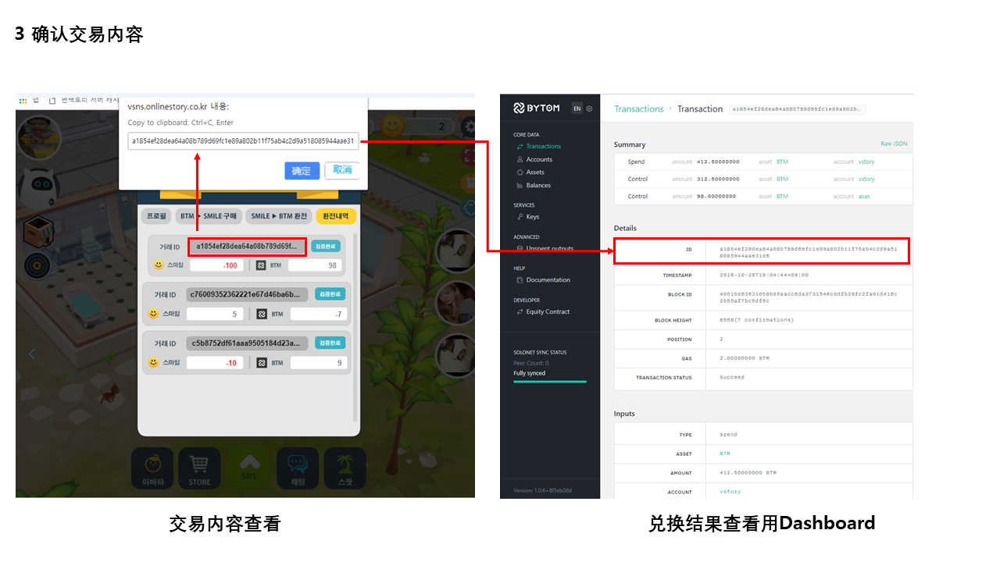

Judging Rules & V-Story Answer  
====

| Table of Contents |
| --- |
| [JR1 Blockchain Adoption](#JR1-Blockchain-Adoption) |
| [JR2 Technology Implementation](#JR2-Technology-Implementation) |
| [JR3 Commercial Value](#JR3-Commercial-Value) |
| [JR4 Creativity](#JR4-Creativity) |
| [JR5 Product Design](#JR5-Product-Design) |

---------------------------------


JR1 Blockchain Adoption
====

All entries must be built on Bytom smart contracts while fully
embodying the value and advantage of Blockchain technology
and proving that the Blockchain technology is definitely
irreplaceable when compared with the solutions based on the
traditional technology. 

JR1 V-Story Answer
----

Social Life Service V-Story는 저작권보호, 보안, 공정성과 투명성을 중시하는 탈중앙화 서비스 입니다.      
  > 저작권에서는 SNS 주요 자산인 사용자들이 생산한 콘텐츠에 대한 저작권을 블록체인 기술을 통해 보호하며,  
  > 보안에서는 사용자 간의 토큰 유통을 블록체인기술로 기록하여 변조를 방지하고 보안성을 높이고,  
  > 공정성과 투명성에서는 토큰의 흐름과 보유 및 보상을 누구나 확인할 수 있게 공개합니다.  
  > 이로 인하여 2차 저작물의 활성화 및 가짜 뉴스 및 악성댓글등의 SNS 사회적 문제 해소,  
  > 개인간 거래의 투명성을 높이고자 합니다.  

우리는 Bytom 블록체인 프로토콜이 가상세계와 현실세계를 연결시켜 인간이 상상할 수 있는   
  > 모든 자산의 거래를 가능하게 하는 쌍방향 프로토콜이며, 세계에서 가장 안전하고 가장 큰 자산거래 및   
  > 관리 프로토콜이 되는 것이 목표이고, 자체적으로 구축한 메인넷 내의 생태계는 개방형, 준법성, 공익성이라는    
  > 3가지 특징이 있음을 확인하였습니다. 이에 V-Story가 추구하는 Social Life Service  플랫폼으로 확장에   
  > 큰 도움이 될 것이라 기대하고 있습니다.  


-------------------------------------

JR2 Technology Implementation
====

The smart contract projects should feature rational design and
complete functional design. Its stable operation is absolutely a
guarantee for efficiency and quality. Moreover, it is designed
with sufficient safety and protection mechanism.  
  
JR2 V-Story Answer


```javascript
if(0==balanceList.size())
{
    btmUserInfo.setBTM((double)0);
    btmUserInfo.setBTM_ACCOUNT_ID(bytomModel.getBtmAccountAlias(id));
}					
else
{	
    userBalanceList = new ArrayList<UserBalance>();
    //DecimalFormat format = new DecimalFormat(".##########");
    for (BalancenoLog result : balanceList)
    {
        if(id.equals(result.accountAlias))
        {	
            if(id.equals(result.accountAlias) && "BTM".equals(result.assetAlias))
            {	
                btmUserInfo.setBTM((double)result.amount/bytomMargin);
                btmUserInfo.setBTM_ACCOUNT_ID(result.accountId);
                break;
            }
        }	
    }
}	

Integer smile = bytomModel.getSmile(accountpk);
JSONObject jsonObject = new JSONObject();
jsonObject.put("RESULT", IConstants.SUCCESS);
jsonObject.put("ACCOUNTID", btmUserInfo.getACCOUNT_ID());
jsonObject.put("GENDER", btmUserInfo.getGENDER());
jsonObject.put("INTRODUCE", btmUserInfo.getINTRODUCE());
jsonObject.put("PROF_PIC_NM", btmUserInfo.getPROF_PIC_NM());
jsonObject.put("BTM", btmUserInfo.getBTM());	
jsonObject.put("BTM_ACCOUNT_ID", btmUserInfo.getBTM_ACCOUNT_ID());	
jsonObject.put("SMILE", smile);	
json = jsonObject.toString();
return json;
```


```javascript
Client client = ByTomConnectionUtil.generateClient();
Account.ReceiverBuilder receiverBuilder =   new Account.ReceiverBuilder().setAccountAlias(reveiverId);
Receiver receiver = receiverBuilder.create(client);	   		
String receiverAddress = receiver.address;
System.out.println("receiverAddress value is:" + receiverAddress);
TransactionnoLog.Template controlAddress = new TransactionnoLog.Builder()
        .addAction(
                new TransactionnoLog.Action.SpendFromAccount()
                        .setAccountAlias(senderId)
                        .setAssetAlias(assetAlias)
                        .setAmount((smile+gas)*bytommargin)
        )
        .addAction(
                new TransactionnoLog.Action.ControlWithAddress()
                        .setAddress(receiverAddress)
                        .setAssetAlias(assetAlias)
                        .setAmount(smile*bytommargin)
        ).build(client);


TransactionnoLog.Template singer = new TransactionnoLog.SignerBuilder().sign(client,
        controlAddress, passwd);	
TransactionnoLog.SubmitResponse txs = TransactionnoLog.submit(client, singer); 
TransactionThread transactionThread = new TransactionThread(client,txs.tx_id,smile,fromAmount,toAmount,serverIndex,accountPk,1002);
transactionThread.start();
return true;
```


```javascript
TransactionnoLog.Template controlAddress = new TransactionnoLog.Builder()
        .addAction(
                new TransactionnoLog.Action.SpendFromAccount()
                        .setAccountAlias(senderId)
                        .setAssetAlias(assetAlias)
                        .setAmount((smile+gas)*bytommargin)
        )
        .addAction(
                new TransactionnoLog.Action.ControlWithAddress()
                        .setAddress(receiverAddress)
                        .setAssetAlias(assetAlias)
                        .setAmount(smile*bytommargin)
        ).build(client);


TransactionnoLog.Template singer = new TransactionnoLog.SignerBuilder().sign(client,
        controlAddress, passwd);	
TransactionnoLog.SubmitResponse txs = TransactionnoLog.submit(client, singer); 
TransactionThread transactionThread = new TransactionThread(client,txs.tx_id,smile,fromAmount,toAmount,serverIndex,accountPk,1002);
transactionThread.start();
return true;
```

```javascript
public List<BalancenoLog> getBalance(String accountAlias,String assetAlias)
{
    List<BalancenoLog> balanceList = null;
    try
    {
        balanceList = new BalancenoLog.QueryBuilder().listByAccountAlias(client, accountAlias); 
    }
    catch(BytomException e)
    {
        e.printStackTrace();
    }
    return balanceList;
}
```



```javascript
public List<BalancenoLog> getBalanceList(String accountAlias)
{
    List<BalancenoLog> balanceList = null;
    try
    {
        balanceList = new BalancenoLog.QueryBuilder().listByAccountAlias(client, accountAlias); 
    }
    catch(BytomException e)
    {
        e.printStackTrace();
    }
    return balanceList;
}

public List<TransactionnoLog> listTransaction(String accountAlias)
{
    List<TransactionnoLog> transactionList = null;
    try
    {
        String bytomId = getBtmAccountAlias(accountAlias);
        transactionList = new TransactionnoLog.QueryBuilder().setAccountId(bytomId).listByAccountId(client);
    }
    catch(BytomException e)
    {
        logger.error(e);
    }
    return transactionList;
}  
```

----


-------------------------------------

JR3 Commercial Value
====

If entries presents great commercial value, they can be
commercialized directly as representatives of industry
application for potential profitability.  
  
JR3 V-Story Answer
----


-------------------------------------

JR4 Creativity
====

Compared with those mature solutions in the industry, entries
should illustrate innovation and creativity with better
performance.  

JR4 V-Story Answer
----

V-Story 텍스트, 사진, 영상을 넘어 아바타, 홈꾸미기 등을 통해 자신만의 개성있는 SNS를 만들며 다른 사용자와  
관계형 네트워크를 형성할 수 있는 새로운 개념의 비쥬얼 Social Life Service 플랫폼입니다.  
  

-------------------------------------
  
JR5 Product Design
====

The interactive design should be reasonable so that customers
can easily understand and use, thus achieving a better user
experience.  
  
JR5 V-Story Answer
----

자신의 기분과 감정을 표현하고 좀 더 깊이 공감할 수 있는 다양한 Visual 상호작용 기능 제공
‘설치’ 없이 다양한 디바이스에서 구동, 외부 콘텐츠와 쉽게 연동
